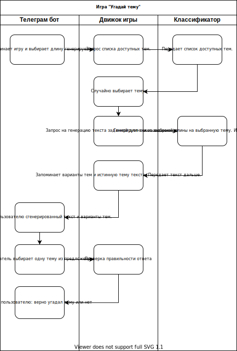

# Chatbot Game

Main paper:
 [Plug and Play Language Models: A Simple Approach to Controlled Text Generation](https://arxiv.org/abs/1912.02164)
 

## Datasets

* [Ubuntu Dialogue Corpus](https://www.kaggle.com/rtatman/ubuntu-dialogue-corpus)

## Pre-trained models

* [Transformers repository](https://github.com/huggingface/transformers)

## Papers

To-Do

## Scheme of the game "Guess topic"
